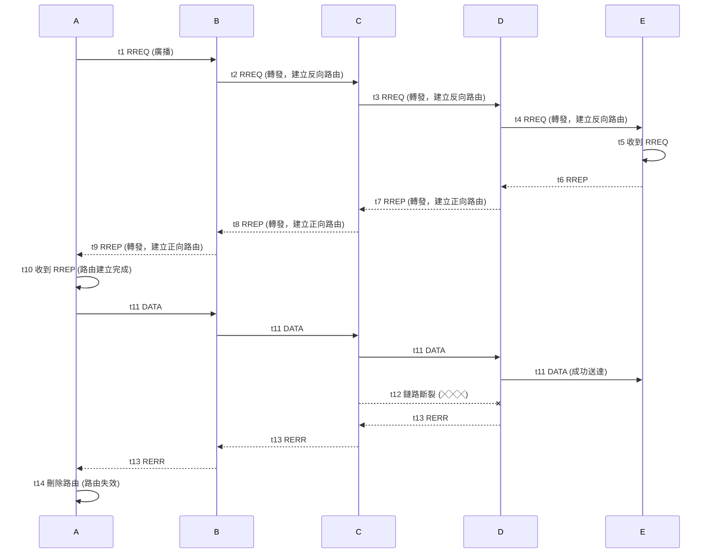

## CH1-2
### 1. 無線區域網路的兩種基本架構

#### Infrastructure Mode

- **架構特點**：透過存取點 (Access Point, AP) 作為中繼站
- **主要優點**：
    - 管理集中化，易於控制和監管
    - 涵蓋範圍較大
    - 可連接有線網路，實現網路互連
    - 支援較多用戶同時連線
    - 具備較佳的安全性管理

#### Ad-hoc Mode

- **架構特點**：P2P 不用AP
- **主要優點**：
    - 成本低，設定簡單
    - 具備自我組織能力
    - 適合移動性高的應用場景


### 2. 行動台服務的五項功能

| 功能      | 英文名稱             | 說明                |
| ------- | ---------------- | ----------------- |
| 1. 驗證   | Authentication   | 驗證身分的合法性          |
| 2. 取消驗證 | Deauthentication | 中斷已建立的驗證關係        |
| 3. 關聯   | Association      | 建立行動台(MS)與AP之間的連接 |
| 4. 重新關聯 | Reassociation    | 在不同AP間切換連接        |
| 5. 解除關聯 | Disassociation   | 中斷與AP的關聯關係        |


### 3. 分散式系統服務的三項功能

 3.1 Distribution
- `BSS <--> WLAN LAN`
3.2 Integration
- `WLAN <--> other network`
3.3 MS Reassociation Support
- sync data during the switch between aps


### 4. IEEE 802.11 MAC 的兩種協調功能

#### 4.1 分散式協調功能 (DCF, Distributed Coordination Function)

- **機制內容**：採用 CSMA/CA機制
[[CH7 無線網路#^aaba23]]

- 避免同時得訊框碰撞
- 流程
	
- **特點**：分散式控制，所有節點平等競爭存取權
- **場景**：一般資料傳輸

#### 4.2 點協調功能 (PCF, Point Coordination Function)

- **概要**：由AP集中控制存取
- **運作特點**：輪詢分配傳輸機會，支援 QoS
- **適用場景**：即時性要求較高的應用

### 5. RTS/CTS 機制詳述

#### 5.1 運作原理

##### RTS (Request to Send)

- 傳送端先送出 RTS 控制框，預約傳輸媒體
- 包含傳輸時間資訊

##### CTS (Clear to Send)

- 接收端回應 CTS 控制框，確認可以接收
- 通知其他節點暫時不要傳輸

#### 5.2 解決的問題

- **隱藏節點問題**：避免無法偵測到彼此的節點同時傳輸
- **暴露節點問題**：減少不必要的等待時間

### 5.3 NAV (Network Allocation Vector)

- 其他節點根據 RTS/CTS 中的時間資訊設定 NAV
- 在 NAV 期間內不進行傳輸，避免碰撞

### 5.4 傳輸流程圖

```
發送端 A    接收端 B    其他節點 C
   |           |           |
   |-- RTS --> |           |
   |           |-- CTS --> | (設定 NAV)
   |-- DATA -->|           | (等待中)
   |<-- ACK ---|           |
   |           |           | (NAV 結束)
```

---

### 6. Backoff 機制詳述

#### 6.1 機制目的

減少碰撞機率，提高網路效率

#### 6.2 運作流程

1. **偵測媒體**：節點欲傳輸時先偵測媒體是否閒置
2. **等待 DIFS**：媒體閒置時等待 DIFS (DCF Inter-frame Space) 時間
3. **競爭視窗**：從競爭視窗 (Contention Window, CW) 中隨機選擇 backoff 時間
4. **倒數計時**：媒體閒置時進行倒數，忙碌時暫停
5. **傳輸或重試**：倒數到零時傳輸；若碰撞則增大 CW 並重新 backoff

#### 6.3 二進位指數退避演算法

##### 演算法規則

- **初始值**：`CW = CWmin`
- **碰撞後**：`CW = min(2×CW+1, CWmax)`
- **成功後**：`CW` 重設為 `CWmin`
- **公平性**：確保所有節點都有平等的傳輸機會

##### 時間軸示例

```
時間 → 0    DIFS    Backoff    傳輸
      |-----|--------|----------|
      閒置   等待     隨機延遲    資料傳送
```

#### 6.4 機制效益

- 分散節點的傳輸時間
- 降低同時傳輸造成的碰撞機率
- 提升整體網路的傳輸效率

## CH3
### 1. DCA 演算法

##### 特點
- 節點需要傳輸時,動態選擇可用的頻道
- 透過監聽機制偵測頻道是否被占用
- 鄰近節點若偵測到頻道被占用,會**延遲處理**或選擇其他頻道
- 避免同時使用相同頻道造成碰撞
##### RTS/CTS
- 解決隱藏節點問題
- `RTS req -> CTS allow -> Data transform -> Ack confirm`

**關鍵機制:**
- CTS會廣播 → 隱藏節點也聽得到
- NAV機制   → 虛擬載波感測
- 頻道預約  → 避免碰撞

##### 如何建立表格

DCA通常維護一個**頻道狀態表(Channel State Table)**:

| 頻道編號 | 狀態  | 使用節點   | 信號強度   | 可用時間  |
| ---- | --- | ------ | ------ | ----- |
| CH1  | 忙碌  | Node A | -45dBm | -     |
| CH2  | 空閒  | -      | -      | 可立即使用 |
| CH3  | 忙碌  | Node C | -60dBm | -     |

**重點:** 鄰近節點透過載波感測(Carrier Sensing)持續更新此表格

### 2. DSDV 路由協定

**就像是dijkstra演算法的距離向量法**

##### 特性
- **主動式(Proactive)路由協定**
- 基於距離向量演算法(類似RIP)
- 每個節點維護完整的路由表+序列編號
- 用編號和路徑成本決定路由表
##### 舉例說明

**網路拓撲:**

```
A ←→ B ←→ C ←→ D
```

**節點B的路由表:**

| 目的地 | 下一跳 | 距離(跳數) | 序號  |
| --- | --- | ------ | --- |
| A   | A   | 1      | 46  |
| C   | C   | 1      | 52  |
| D   | C   | 2      | 38  |

**序號機制(Sequence Number):**
- 每個目的地都有序號,用於避免路由迴圈
- 序號越大代表路由資訊越新
- 當B收到更大序號的路由更新時,才會更新路由表

**重點:** DSDV透過定期廣播路由更新和序號機制,確保路由表的一致性和即時性
### 3. DSR 回應式路由

##### 特點
- **回應式(Reactive)路由協定**
- **來源路由(Source Routing)**:完整路徑記錄在封包標頭
- **路由探索**: 沒有可用的時候會發送的RREQ 透過廣播進行感知
- 不需維護路由表

##### 運作流程

**階段1: 路由發現(Route Discovery)**

```
A想傳送給D:
A → broadcast RREQ
B收到 → 加入自己ID → 轉發RREQ [A,B]
C收到 → 加入自己ID → 轉發RREQ [A,B,C]
D收到 → 回傳RREP [A,B,C,D]
```

**階段2: 路由維護(Route Maintenance)**

- 使用路由快取(Route Cache)儲存已知路徑
- 連結中斷時觸發路由錯誤(RERR)訊息
- 來源節點重新啟動路由發現

**封包格式:**

```
[來源|目的|路徑資訊:A→B→C→D|資料]
```

**重點:** DSR將完整路徑資訊放在封包中,中間節點只需依序轉發,不用查詢路由表

### 4. AODV 回應式路由協定
##### 特點
- 回應式路由
- 結合**DSR的按需特性** + **DSDV的路由表與序號機制**
- 只有在需要時才建立路由
- 使用跳數(hop count)作為路由度量

##### 運作原理

**1. 路由請求(RREQ)階段:**

```
節點A要傳送給節點E:

A廣播RREQ → B,C收到
B,C建立反向路由(指向A) → 繼續廣播RREQ
最終E收到RREQ
```

**2. 路由回覆(RREP)階段:**
建立反向路徑

```
E單播RREP沿反向路由回A
中間節點建立正向路由(指向E)
A收到後產生RREP(送回去) → 路由建立完成
```


